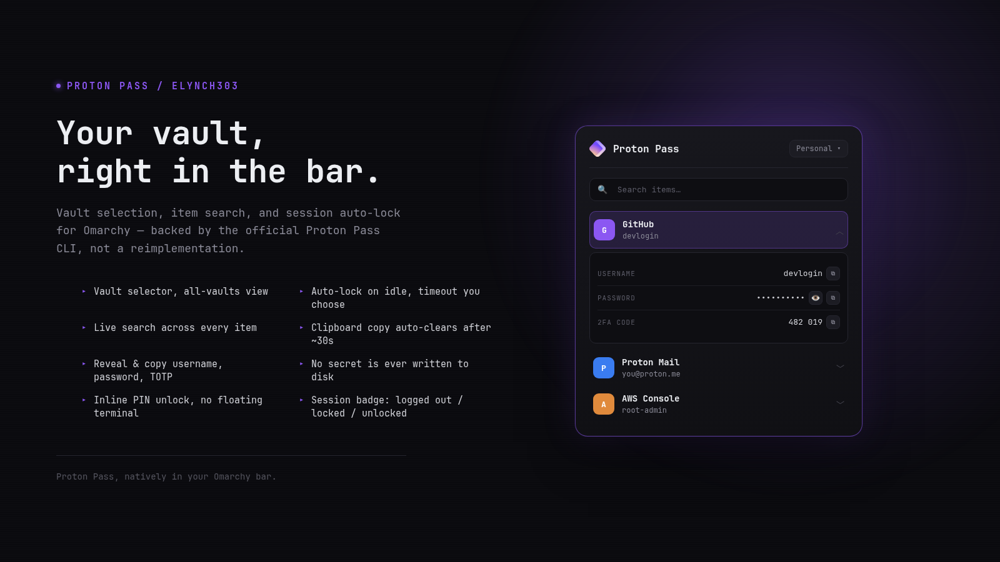

# Proton Pass

An [Omarchy](https://omarchy.com) bar-widget plugin that brings Proton Pass
into your bar: vault selection, item search, and session auto-lock — backed
by the official [`pass-cli`](https://proton.me/pass), not a reimplementation.



## Features

- Bar badge reflects session state: not installed / logged out / locked / unlocked,
  with a lock glyph badge in the corner when locked
- Vault selector, with an "All vaults" view
- Live item search across titles
- Click an item to reveal and copy username, password, or a TOTP code —
  copies go through the clipboard and **auto-clear after 30s (configurable)**
- Inline PIN-based auto-lock: set a PIN and your own idle timeout (30–900s)
  from the gear-icon Settings panel, then unlock with a 6-box PIN entry —
  no floating terminal needed for day-to-day lock/unlock
- Login still opens a floating terminal, since it's a one-time interactive
  web-login/2FA flow — the login URL opens in your browser automatically
  the moment pass-cli prints it, no copy-pasting needed
- Per-item favicons for logins titled by domain (most autosaved logins are),
  fetched directly from the site itself — see "How it works" below
- No secret values are ever written to disk by this plugin — everything is
  fetched from `pass-cli` on demand

## Requirements

- [Omarchy](https://omarchy.com) with Quickshell
- [`pass-cli`](https://proton.me/pass) — the official Proton Pass CLI
  (AUR: `proton-pass-cli-bin` or `proton-pass-cli`)
- You must have run `pass-cli login` at least once before the widget will
  show anything beyond a "log in" prompt
- `wl-copy` / `wl-clipboard` for the clipboard-copy actions
- `curl` and `file` for per-item favicons (both are near-universal on Linux;
  favicons just silently stay off without them)

## Installation

```
omarchy plugin add https://github.com/elynch303/proton-pass.git
```

Then run the install step to place the helper script:

```
bash ~/.config/omarchy/plugins/io.github.elynch303.proton-pass/install.sh
```

Add it to your bar layout in `~/.config/omarchy/shell.json`:

```json
{ "id": "io.github.elynch303.proton-pass" }
```

## Settings

Click the gear icon in the popup header (while unlocked) to open Settings:

- Auto-lock status and setup/removal — moved here from the list view
- **Clear clipboard after** — how long a copied secret stays on the
  clipboard before auto-clearing (default 30s, 5–300s range)

Saved to `~/.local/state/omarchy/plugins/io.github.elynch303.proton-pass/settings.json`.
This is a plain integer preference, not a cache of anything sensitive — no
vault secret is ever written there or anywhere else.

## How it works

`qs-protonpass.sh` (installed to `~/.local/bin`) wraps `pass-cli` and
normalizes its output to JSON for the widget: session status, vault list,
item metadata (no secrets), single-field secret reveal for copy actions, and
TOTP generation. The widget polls `qs-protonpass.sh status` on a light
interval to keep the bar badge accurate, and only fetches vault/item data
when the popup is open.

Locking follows `pass-cli`'s own session lock — this plugin doesn't
reimplement idle detection, it just surfaces `pass-cli session create-lock` /
`lock` / `unlock` / `remove-lock` in the UI. Since those commands only accept
the lock code through a real TTY prompt, `qs-protonpass-tty.py` (also
installed to `~/.local/bin`) drives that prompt over a pseudo-terminal so the
PIN can be typed inline in the popup. The PIN is read once from the script's
own stdin and written straight into the pty — it never appears in any
process's argv and is never written to disk. The idle timeout you choose at
setup is `pass-cli`'s own — nothing here is hardcoded or read from any
browser extension.

Login works the same way (`pass-cli login` also needs a real TTY),
via `qs-protonpass-login.py`: it relays `pass-cli login` through a pty
transparently into the floating terminal, so it looks and behaves exactly
like running the command yourself, while also watching the relayed output
for the login URL and opening it in your default browser (`xdg-open`) the
moment it appears.

`pass-cli item list` doesn't return URLs (only `item view`/`detail` does,
which is too costly to call for every row), so favicons are guessed from
the item's title: if a login is titled by bare domain (e.g. "aircanada.com",
which is what most browser-autosaved logins end up titled), the widget
fetches `https://<that domain>/favicon.ico` directly and caches the result
to `~/.cache/proton-pass/favicons` — hits and misses both, so a cold vault
only pays the network cost once. Titles that aren't domain-shaped just keep
the existing colored-letter avatar; no fetch is attempted for those.

## Security notes

- Clipboard-copy model, not autofill — nothing is typed into other windows
- Clipboard is cleared automatically 30s after a copy by default
  (`clipboardClearSeconds`, see "Settings" above), regardless of
  whether the popup is still open — closing the popup to go paste
  elsewhere (the normal way to actually use a copy) does not clear it early
- Item search/list only ever fetches metadata (title, type, vault); actual
  secret values are fetched one field at a time, only when you click copy
- No vault secret is ever cached to `~/.cache` or anywhere else on disk.
  The one exception is favicons: item titles that look like a domain are
  used to fetch and cache `https://<domain>/favicon.ico` directly from that
  site — never through a third-party favicon proxy — so those domain names
  (not any vault content) are visible to the sites themselves and cached
  locally as plain image files
- Your PIN never appears in process argv and is never written to disk —
  see "How it works" above
- TOTP codes are computed locally in this wrapper (standard RFC 6238 HMAC,
  fed the `otpauth://` URI on stdin) rather than by shelling out to
  `pass-cli totp generate SECRET`, so the TOTP seed never appears in any
  process's argv either

## Uninstalling

```
omarchy plugin remove io.github.elynch303.proton-pass
rm -f ~/.local/bin/qs-protonpass.sh ~/.local/bin/qs-protonpass-tty.py ~/.local/bin/qs-protonpass-copy.py ~/.local/bin/qs-protonpass-login.py
rm -rf ~/.cache/proton-pass
rm -rf ~/.local/state/omarchy/plugins/io.github.elynch303.proton-pass
```

Then remove its entry from `~/.config/omarchy/shell.json` if you added one.
The favicon cache and the settings file above (just the clipboard-timeout
preference, see "Settings") are the only things this plugin ever writes to
disk — no vault secret is ever written anywhere.

## License

MIT
